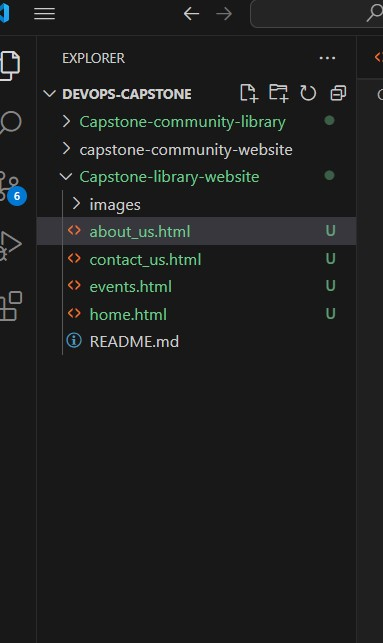

# CapStone Project: Enhancing a Community Library Website

Background Scenario

You're part of a development team tasked with enhancing the website for the "Greenwood Community Library." The website aims to be more engaging and informative for its visitors. It currently includes basic sections: Home, About Us, Events, and Contact Us. Your team decides to add a "Book Reviews" section and update the "Events" page to feature upcoming community events.

You will simulate the roles of two contributors: "Morgan" and "Jamie." Morgan will focus on adding the "Book Reviews" section, while Jamie will update the "Events" page with new community events.

## Project setup 
1. I created a folder called greenwood-lbrary-website2 in my local system
2. I changed directory into it
3. I created a README.md for documentation
4. I then staged and commit the greenwood-library-website2 folder by running git commands: git add .
git commit -m "commit message"
5. I went to my github account to create a repository

## Tasks
1. I created the following files as required
* about_us.html
* contact_us.html
* events.html
* home.html 

